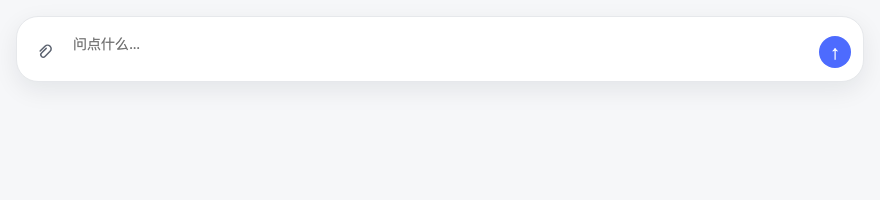
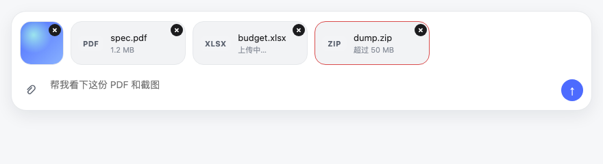
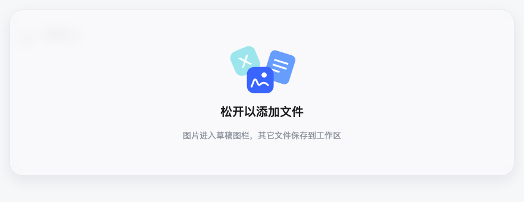
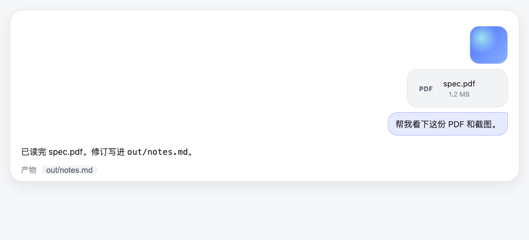

<div align="center">

# dsh-files-native

**给 [DeepSeek Harness](https://github.com/deepseek-ai) 接近原生质感的附件上传：拖入 / 粘贴 / 回形针，图片缩略图与文件卡混排在官方输入框同一条轨。**

[](https://awesome-dsh-plugin.com)
[](https://github.com/topics/dsh-plugin)
[](https://www.npmjs.com/package/dsh-files-native)
[](./LICENSE)

</div>

## ⭐ 欢迎点星收藏

如果附件轨帮到了你，欢迎到 [GitHub 仓库](https://github.com/meyaomiao/dsh-files-native) 点个 Star ⭐，让更多 DSH 用户看到它。问题与建议请提 Issue。

## 📋 兼容性

| 插件版本 | 状态 | 对应 DSH |
|---|---|---|
| **0.2.x**（当前主线，含 0.2.2） | ✅ | **0.1.5-rc.1 / 0.1.5-rc.2**（及之后的 0.1.5 线） |
| 0.1.x | 🔧 维护态（仅修 bug） | DSH ≤ 0.1.2-rc.1（仍兼容 0.1.1-rc.2 / 0.1.2-alpha.4） |

### 本次升级功能变化

- **官方已有的交给官方**：回复尾的「产物」卡不再由本插件绘制，改用 DSH 官方交付文件卡（0.1.5-rc.2 起排版/图标更紧）。用户气泡旁的附件卡仍由本插件画。
- **粘贴让路**：纯官方四类图（PNG / JPEG / WebP / GIF）交给官方草稿图；其它文件仍走本插件轨。
- **不依赖 better-sidebar**：模块 `inject` 只有 `slots`。有侧栏则气泡卡走预览，没有则新页签打开。
- 不要和 `dsh-file-fix` / `dsh-file-upload` / `dsh-paste-to-path` 叠装。

运行时插件 id 仍是 `file-native`（上传路由 `/plugins/file-native/*`）。npm / GitHub 仓库名是 `dsh-files-native`。

- **图片**（PNG / JPEG / WebP / GIF）走官方草稿图栏（64px 缩略图，点击灯箱），发送后进模型视觉上下文。
- **其它文件**落到会话工作区 `.dsh-uploads/`，同一条轨上用 64px 高可读横条卡（扩展名角标 + 文件名 + 大小）。
- **附件只跟随「立即发送」的消息**：忙碌时回车 = 纯文字排队，文件留在附件轨等下次空闲发送。
- **气泡附件卡**：消息发出后，文件卡渲染在用户气泡上方（与图片同列右对齐），注入提示行自动隐藏。
- **点击打开**：点气泡附件卡——装了 [better-sidebar](https://github.com/用户/dsh-better-sidebar) 走侧栏预览；未装则新页签打开（文本/图片/PDF 页签内展示，二进制自动下载）。
- 发送后文件卡贴在用户气泡栈（与官方图同一列），作业回复不会插在提问和文件中间。
- 发送成功即清输入框待发轨。**回复尾产物卡让给官方。**

不要和 `dsh-file-fix` / `dsh-file-upload` / `dsh-paste-to-path` 叠装。

## 截图

| 空输入框（回形针在左，无额外上边距） | 待发：图 + 已上传 / 上传中 / 超限 |
|---|---|
|  |  |

| 拖入窗口任意位置 | 发送后：图与文件卡跟用户气泡（产物走官方卡） |
|---|---|
|  |  |

本地预览页（可切状态）：打开仓库里的 [`preview.html`](preview.html)。市场截图清单见 [`screenshots.json`](screenshots.json)。

## 入口

| 操作 | 行为 |
|---|---|
| 拖进窗口任意位置 | 全屏「松开以添加文件」；松手即分流，不必对准卡片 |
| Ctrl+V 粘贴文件 | 同上分流；纯文本粘贴不受影响 |
| 输入框回形针 | `multiple` 文件选择，不限格式 |
| Esc | 取消本次拖入 |

## 安装

```bash
# 方式〇: npm（推荐）
npm i -g dsh-files-native
dsh plugin --profile web add dsh-files-native

# 方式一: GitHub
dsh plugin --profile web add github:meyaomiao/dsh-files-native

# 方式二: 克隆后本地挂载
git clone https://github.com/meyaomiao/dsh-files-native.git
cd dsh-files-native
pnpm install && pnpm build
dsh plugin --profile web add .
```

然后彻底重启 `dsh web`，浏览器硬刷新。宿主入口的 `inject` 必须含 `webServer` 与 `sessions`（漏了 DSH 会起不来，见 [插件开发门禁](docs/plugin-dev-gate.md)）。

## 当前实现

| 半区 | 入口 | Cordis `inject` | 职责 |
|---|---|---|---|
| host | `src/index.ts` | `webServer`, `sessions` | loopback 上传/删除；文件落到会话 cwd `.dsh-uploads/`；`agent/pre-step` 注入路径清单 |
| client | `src/client.ts` | `slots` | 整窗拖入/粘贴拦截；回形针；输入框混排轨；对话区文件卡 |

关键约束：

- **禁止**在渲染路径调用 `useSession` / `useInput`。会话 id 只读 `InputZone` 快照 `session.id`。
- **禁止**对聊天时间线挂 `MutationObserver`。卡片一次性 portal 进相邻用户气泡栈。
- 空输入框时 `[data-file-native-host]:empty` 隐藏，避免 composer `gap` 多出一截上边距。有文件时轨 padding 对齐官方图栏 `4px 12px 0`。

## 限制

- 单文件 50 MB，单批 20 个。
- 上传路由仅 loopback。
- 刷新会丢掉「已上传未发送」的文件卡（磁盘文件仍在 `.dsh-uploads/`）。

改仓库前先读 [CONTRIBUTING.md](./CONTRIBUTING.md)（Issue → 分支 → Draft PR）。思考原则见 [AI-ISSUE-WORKFLOW.md](./AI-ISSUE-WORKFLOW.md)。插件硬约束见 [AGENTS.md](./AGENTS.md)。
